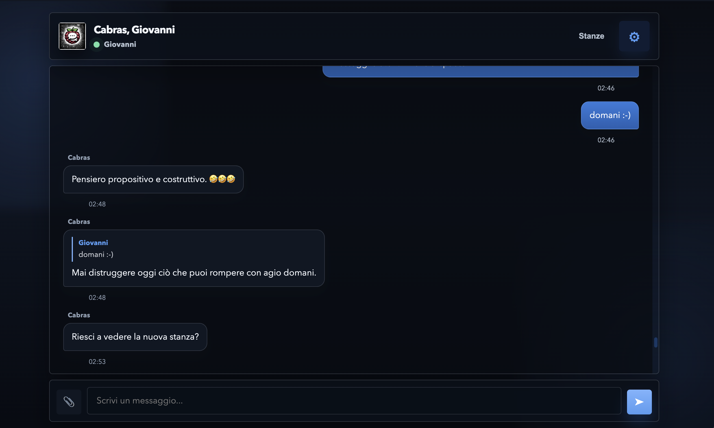
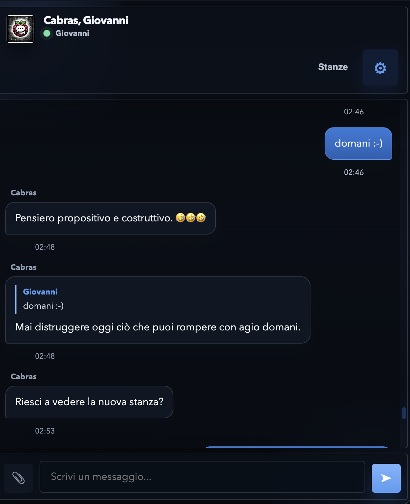

# raspi-chat

<p align="center">
  
</p>

<p align="center">
  <a href="README.it.md">🇮🇹 Leggi in italiano</a>
</p>

Self-hosted web chat designed for Raspberry Pi and small home servers.

<p align="center">
  
  &nbsp;&nbsp;
  
</p>

The project includes:
- Node.js/Fastify backend
- Web/PWA frontend with no framework
- Realtime messages via WebSocket
- Local SQLite
- Image upload
- Link preview
- Web Push notifications

Live reference URL:

`https://chat.tongatron.org/chat`

## Who is it for

This project makes sense if you want:
- a simple chat to self-host
- something lighter than Matrix, Rocket.Chat or similar
- an app that runs well even on older Raspberry Pi boards
- a clear codebase to adapt for a private, family or small community chat

It is not meant as an enterprise alternative to Slack/Discord. It is a pragmatic, small and hackable codebase.

## Current state

The repo is the source of truth for the chat.

It contains:
- web app and backend
- public assets
- deploy documentation

It does not contain:
- `.env`
- `config/chat-users.json`

## Structure

```text
raspi-chat/
├── config/                      User configuration examples
├── ops/                         Raspberry deploy examples
├── public/                      Frontend, PWA
├── src/                         Fastify backend
├── .env.example
├── package.json
└── server.js
```

## Minimum requirements

- Node.js 20+
- npm
- Linux or Raspberry Pi OS
- Reverse proxy optional but recommended

## Quick install

### Local

```bash
git clone https://github.com/tongatron/raspi-chat.git
cd raspi-chat
npm install
npm run check
npm start
```

If you have not configured the project yet, open:

`http://127.0.0.1:3000/setup`

If you already have `.env` and `config/chat-users.json`, the chat will be available at:

`http://127.0.0.1:3000/chat`

### Raspberry Pi

```bash
git clone https://github.com/tongatron/raspi-chat.git /srv/apps/raspi-chat
cd /srv/apps/raspi-chat
bash ops/install-rpi.sh
```

Then:
1. Start the app once with `npm start`
2. Open the wizard at `http://raspberrypi.local:3000/setup` or `http://RASPBERRY-IP:3000/setup`
3. Complete the web steps
4. Use the generated files in `data/setup-generated/`
5. Enable `systemd`

Useful commands:

```bash
sudo systemctl daemon-reload
sudo systemctl enable --now fastify-api
sudo systemctl status fastify-api
journalctl -u fastify-api -f
```

## Web-based guided setup

The recommended path for first-time installs:

1. `bash ops/install-rpi.sh`
2. `npm start`
3. Open `/setup`
4. Fill in the steps
5. Copy the generated files
6. Enable the service

The `/setup` wizard does the following:

- checks that the folder is writable
- collects chat name, host, port and network mode
- creates the initial admin user and base users
- automatically generates VAPID keys for Web Push
- writes `.env`
- writes `config/chat-users.json`
- creates `data/setup-complete.json`
- generates:
  - `data/setup-generated/fastify-api.service`
  - `data/setup-generated/nginx.chat.conf`
  - `data/setup-generated/cloudflared.config.yml`

When setup is complete, `/setup` deactivates and the app returns to showing the normal chat.

Practical note:

- by default `/setup` is only accessible from the local network
- to force remote access, export `SETUP_ALLOW_REMOTE=1`

## Configuration

### Users

The users file is external to the code:

`config/chat-users.json`

Example:

```json
[
  { "username": "Giovanni", "password": "change-me-giovanni", "role": "admin" },
  { "username": "Operator", "password": "change-me-operator", "role": "superuser" },
  { "username": "Cabras", "password": "change-me-cabras", "role": "user" }
]
```

### Environment variables

The main ones are documented in `.env.example`:

- `HOST`, `PORT`
- `CHAT_USERS_FILE`
- `TOKEN_SECRET`
- `DEFAULT_ADMIN_USERNAME`
- `DEFAULT_ROOM_NAME`
- `VAPID_PUBLIC_KEY`, `VAPID_PRIVATE_KEY`, `VAPID_EMAIL`

## Typical deploy

Recommended setup on Raspberry:

- Node app listening on `127.0.0.1:3000`
- `systemd` for the process
- `nginx` in front
- Optional Cloudflare tunnel or public DNS

Recommended path:

`/srv/apps/raspi-chat`

## Cloudflare

If you want to expose the chat on the internet without directly opening ports on the Raspberry, the most practical way is to use Cloudflare Tunnel with `cloudflared`.

Typical scenario:

- Node app on `127.0.0.1:3000`
- `cloudflared` on the Raspberry
- Public hostname like `chat.example.com`
- No direct port forwarding from home

### What you need first

- a Cloudflare account
- a domain managed by Cloudflare
- the project already working locally at `http://127.0.0.1:3000/chat`

### Recommended flow

1. Add the domain to Cloudflare if not already there
2. Install `cloudflared` on the Raspberry following the official guide
3. Authenticate `cloudflared` with your Cloudflare account
4. Create a dedicated tunnel, e.g. `raspi-chat`
5. Link a public hostname to the tunnel, e.g. `chat.example.com`
6. Configure the tunnel ingress to `http://127.0.0.1:3000`
7. Install `cloudflared` as a systemd service

### Typical commands

After installing `cloudflared`:

```bash
cloudflared tunnel login
cloudflared tunnel create raspi-chat
cloudflared tunnel route dns raspi-chat chat.example.com
```

Example config at `/etc/cloudflared/config.yml`:

```yaml
tunnel: <TUNNEL_ID>
credentials-file: /home/giovanni/.cloudflared/<TUNNEL_ID>.json

ingress:
  - hostname: chat.example.com
    service: http://127.0.0.1:3000
  - service: http_status:404
```

Then:

```bash
sudo cloudflared service install
sudo systemctl enable --now cloudflared
sudo systemctl status cloudflared
```

If you used the wizard, you'll find a ready-made base at:

`data/setup-generated/cloudflared.config.yml`

### Cloudflare and nginx

Two sensible options:

- Direct tunnel to `http://127.0.0.1:3000`
- Tunnel to `nginx`, if you want to use nginx for other local rules as well

If you only use the chat, the direct tunnel to Fastify is often the simplest choice.

### DNS and hostname

With `cloudflared tunnel route dns`, Cloudflare creates the DNS record needed for the public hostname associated with the tunnel.

Example:

- public hostname: `chat.example.com`
- local service: `http://127.0.0.1:3000`

### WebSocket and realtime chat

The chat uses WebSocket on `/chat/ws`. With Cloudflare Tunnel no additional app-side configuration is needed: the tunnel forwards HTTP/WebSocket traffic to the configured local service.

### Final check

First check locally:

```bash
curl http://127.0.0.1:3000/health
```

Then verify from the public domain:

```bash
curl -I https://chat.example.com/chat
```

Useful checks:

- `sudo systemctl status fastify-api`
- `sudo systemctl status cloudflared`
- `journalctl -u cloudflared -f`
- `journalctl -u fastify-api -f`

### Practical notes

- if you use PWA and notifications, a stable public domain is important
- if you want extra protection, you can add a Cloudflare Access policy in front of the domain, but for a typical private chat it is usually not needed

## Useful endpoints

Public:
- `GET /chat`
- `POST /chat/login`
- `GET /chat/ws`
- `GET /chat/manifest.json`
- `GET /sw.js`
- `GET /health`
- `GET /version`

Private:
- `GET /chat/messages`
- `POST /chat/upload`
- `GET /chat/images/:filename`
- `GET /chat/preview`
- `GET /chat/console/data`

## Quick check

```bash
curl http://127.0.0.1:3000/health
```

```bash
curl -X POST \
  -H 'Content-Type: application/json' \
  -d '{"username":"Test","password":"..."}' \
  http://127.0.0.1:3000/chat/login
```

```bash
npm run check
```

## Positioning vs other projects

If you want a heavily structured and federated chat, there are larger options like Matrix or Snikket.

If instead you want:
- minimal external dependencies
- simple deploy
- local storage
- ease of modification

then `raspi-chat` is a lighter base better suited to Raspberry/home server use.

## Suggested next steps

- add an explicit "public room" mode
- improve the guided setup automation further
- document backup/restore of `chat.db`
- add minimal automated tests
