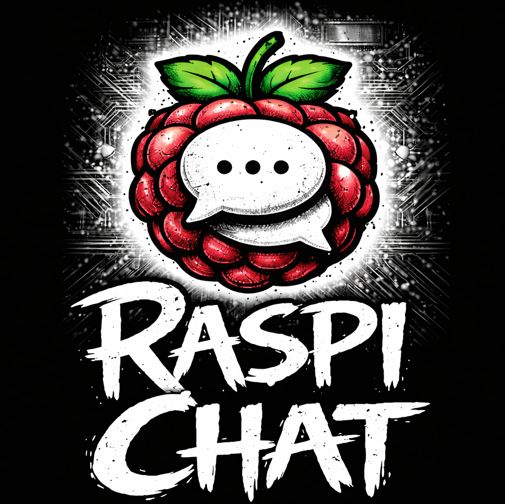

# raspi-chat

<p align="center">
  
</p>

<p align="center">
  <a href="README.it.md">🇮🇹 Leggi in italiano</a>
</p>

Self-hosted web chat designed for Raspberry Pi and small home servers.

<p align="center">
  
</p>
<p align="center">
  
</p>

The project includes:
- Node.js/Fastify backend
- Web/PWA frontend with no framework
- Realtime messages via WebSocket
- Local SQLite
- Image and attachment upload
- Link preview
- Web Push notifications
- Optional at-rest encryption (chat.db + attachments, via `CHAT_DB_KEY`)
- Terminal CLI client

Live reference URL:

`https://chat.tongatron.org/chat`

## Who is it for

This project makes sense if you want:
- a simple chat to self-host
- something lighter than Matrix, Rocket.Chat or similar
- an app that runs well even on older Raspberry Pi boards
- a clear codebase to adapt for a private, family or small community chat

It is not meant as an enterprise alternative to Slack/Discord. It is a pragmatic, small and hackable codebase.

## Current state

The repo is the source of truth for the chat.

It contains:
- web app and backend
- public assets
- deploy documentation

It does not contain:
- `.env`
- `config/chat-users.json`

## Structure

```text
raspi-chat/
├── cli/                         Terminal chat client
├── config/                      User configuration examples
├── ops/                         Raspberry deploy examples
├── public/                      Frontend, PWA
├── src/                         Fastify backend
├── .env.example
├── package.json
└── server.js
```

## Minimum requirements

- Node.js 20+
- npm
- Linux or Raspberry Pi OS
- Reverse proxy optional but recommended

## Quick install

### Local

```bash
git clone https://github.com/tongatron/raspi-chat.git
cd raspi-chat
npm install
npm run check
npm start
```

If you have not configured the project yet, open:

`http://127.0.0.1:3000/setup`

If you already have `.env` and `config/chat-users.json`, the chat will be available at:

`http://127.0.0.1:3000/chat`

### Raspberry Pi

```bash
git clone https://github.com/tongatron/raspi-chat.git /srv/apps/raspi-chat
cd /srv/apps/raspi-chat
bash ops/install-rpi.sh
```

Then:
1. Start the app once with `npm start`
2. Open the wizard at `http://raspi4.local:3000/setup` or `http://RASPBERRY-IP:3000/setup`
3. Complete the web steps
4. Run `sudo bash data/setup-generated/finish-setup.sh`

That script copies the generated service file, runs `systemctl daemon-reload` and `enable --now`, and (when network mode is `nginx`) also installs and reloads the nginx vhost.

Useful commands:

```bash
sudo systemctl status raspi-chat
journalctl -u raspi-chat -f
```

## Web-based guided setup

The recommended path for first-time installs:

1. `bash ops/install-rpi.sh`
2. `npm start`
3. Open `/setup`
4. Fill in the steps
5. Run `sudo bash data/setup-generated/finish-setup.sh`

The `/setup` wizard does the following:

- checks that the folder is writable
- collects chat name, host, port and network mode
- creates the initial admin user and base users
- automatically generates VAPID keys for Web Push
- writes `.env`
- writes `config/chat-users.json`
- creates `data/setup-complete.json`
- generates:
  - `data/setup-generated/raspi-chat.service`
  - `data/setup-generated/nginx.chat.conf`
  - `data/setup-generated/cloudflared.config.yml`
  - `data/setup-generated/finish-setup.sh` (executable script that installs and enables the systemd service, and the nginx vhost when network mode is `nginx`)

When setup is complete, `/setup` deactivates and the app returns to showing the normal chat. Cloudflare mode still needs `cloudflared.config.yml` filled in by hand (it needs the tunnel ID) and `cloudflared` started separately — the wizard can't automate that part.

Practical note:

- by default `/setup` is only accessible from the local network
- to force remote access, export `SETUP_ALLOW_REMOTE=1`

## Configuration

### Users

The users file is external to the code:

`config/chat-users.json`

Example:

```json
[
  { "username": "Giovanni", "password": "change-me-giovanni", "role": "admin" },
  { "username": "Operator", "password": "change-me-operator", "role": "superuser" },
  { "username": "Cabras", "password": "change-me-cabras", "role": "user" }
]
```

### Public rooms

Besides private rooms (invite-only membership, managed by the creator or an admin), any
user can create a **public room**: any authenticated user can discover it and join on
their own, no invite required.

- From the web client: **Rooms → + New room...** menu, check "Public room (anyone can
  find and join it)".
- To discover and join: **Rooms → ⌘ Browse public rooms...** lists every public room
  with its member count; the **Join** button adds the user as a member immediately (no
  approval needed).
- Via the API: `POST /chat/my-rooms` accepts `{ name, members, isPublic: true }`;
  `GET /chat/public-rooms` lists public rooms; `POST /chat/public-rooms/:roomId/join`
  performs the join. See `specs/009-explicit-public-room/`.

### Environment variables

The main ones are documented in `.env.example`:

- `HOST`, `PORT`
- `CHAT_USERS_FILE`
- `CHAT_DB_PATH`
- `CHAT_DB_KEY` (at-rest encryption, see below)
- `TOKEN_SECRET`
- `DEFAULT_ADMIN_USERNAME`
- `DEFAULT_ROOM_NAME`
- `VAPID_PUBLIC_KEY`, `VAPID_PRIVATE_KEY`, `VAPID_EMAIL`

### At-rest encryption of `chat.db` (optional)

By default `chat.db` is a plaintext SQLite file. Set `CHAT_DB_KEY` to encrypt it
at rest (messages, password hashes, invites). The **same key** also encrypts the
attachments in `data/uploads/` (spec 007). It is **opt-in**: with no key the
behaviour is unchanged.

```bash
# generate a strong key and store it in .env (git-ignored)
echo "CHAT_DB_KEY=$(openssl rand -hex 32)" >> .env

# encrypt an existing plaintext chat.db (makes a .plain.bak backup first)
CHAT_DB_KEY=... node ops/encrypt-db.js

# encrypt existing plaintext attachments (optional; backs up to uploads.plain.bak/)
CHAT_DB_KEY=... node ops/encrypt-uploads.js
```

⚠️ **Keep the key safe outside the Pi** (password manager/backup). If you lose
`CHAT_DB_KEY`, the encrypted data (chat.db and attachments) is unrecoverable.
See `specs/004-encrypted-chat-db/` and `specs/007-encrypted-attachments/`.

**Status on the reference deployment (`raspi4`)**: encryption has been active in
production since 2026-07-20 — `chat.db` and all attachments in `data/uploads/` are
encrypted, the key lives only in `.env` on the Pi and in the operator's password
manager (not in this repo), and the pre-migration plaintext backups have been
deleted after verifying the app still worked end-to-end.

### Backup and restore of `chat.db`

Only users with the `admin` role can download or restore the database.

**From the web panel** (gear icon → *Admin* → *Backup & Restore* section):
- **⬇ Download backup** — downloads `chat.db` as-is (calls `GET /chat/admin/backup`).
- **⬆ Restore from file** — uploads a `.db` file and overwrites the current database
  (calls `POST /chat/admin/restore`). Asks for confirmation because it **overwrites all
  current data and restarts the server**.

**Via CLI/curl** (needs an admin token obtained from `POST /chat/login`):

```bash
# download the backup
curl -H "X-Chat-Username: Admin" -H "X-Chat-Token: $TOKEN" \
  http://127.0.0.1:3000/chat/admin/backup -o chat-backup.db

# restore from a backup
curl -X POST -H "X-Chat-Username: Admin" -H "X-Chat-Token: $TOKEN" \
  -H "Content-Type: application/octet-stream" \
  --data-binary @chat-backup.db \
  http://127.0.0.1:3000/chat/admin/restore
```

Important notes:
- **Backup** exports the `chat.db` file as-is: if `CHAT_DB_KEY` is set, the downloaded
  backup is **encrypted** (spec 004) — keep it with the same care as the key.
- **Restore** only accepts a file openable with the server's **currently configured**
  encryption: a plaintext backup when there's no `CHAT_DB_KEY`, an encrypted backup with
  the current key otherwise. A file with the wrong key, a non-SQLite file, or one
  missing the chat schema is rejected with a 400 (spec 005). Before overwriting, the
  server still keeps a safety copy of the current DB at `chat.db.bak`.
- Restore **restarts the process** right after writing: under systemd it comes back up
  on its own (`Restart=always`); under `npm run dev`/`node --watch` it restarts on the
  fly; with plain `npm start` you need to restart it manually.
- The backup only copies the main `chat.db` file, not the `-wal`/`-shm` files: if the
  server is running with an active WAL, a consistent backup is best taken right after a
  checkpoint (e.g. right after a restart) or with the service briefly stopped.

## Typical deploy

Recommended setup on Raspberry:

- Node app listening on `127.0.0.1:3000`
- `systemd` for the process
- `nginx` in front
- Optional Cloudflare tunnel or public DNS

Recommended path:

`/srv/apps/raspi-chat`

## Cloudflare

If you want to expose the chat on the internet without directly opening ports on the Raspberry, the most practical way is to use Cloudflare Tunnel with `cloudflared`.

Typical scenario:

- Node app on `127.0.0.1:3000`
- `cloudflared` on the Raspberry
- Public hostname like `chat.example.com`
- No direct port forwarding from home

### What you need first

- a Cloudflare account
- a domain managed by Cloudflare
- the project already working locally at `http://127.0.0.1:3000/chat`

### Recommended flow

1. Add the domain to Cloudflare if not already there
2. Install `cloudflared` on the Raspberry following the official guide
3. Authenticate `cloudflared` with your Cloudflare account
4. Create a dedicated tunnel, e.g. `raspi-chat`
5. Link a public hostname to the tunnel, e.g. `chat.example.com`
6. Configure the tunnel ingress to `http://127.0.0.1:3000`
7. Install `cloudflared` as a systemd service

### Typical commands

After installing `cloudflared`:

```bash
cloudflared tunnel login
cloudflared tunnel create raspi-chat
cloudflared tunnel route dns raspi-chat chat.example.com
```

Example config at `/etc/cloudflared/config.yml`:

```yaml
tunnel: <TUNNEL_ID>
credentials-file: /home/giovanni/.cloudflared/<TUNNEL_ID>.json

ingress:
  - hostname: chat.example.com
    service: http://127.0.0.1:3000
  - service: http_status:404
```

Then:

```bash
sudo cloudflared service install
sudo systemctl enable --now cloudflared
sudo systemctl status cloudflared
```

If you used the wizard, you'll find a ready-made base at:

`data/setup-generated/cloudflared.config.yml`

### Cloudflare and nginx

Two sensible options:

- Direct tunnel to `http://127.0.0.1:3000`
- Tunnel to `nginx`, if you want to use nginx for other local rules as well

If you only use the chat, the direct tunnel to Fastify is often the simplest choice.

### DNS and hostname

With `cloudflared tunnel route dns`, Cloudflare creates the DNS record needed for the public hostname associated with the tunnel.

Example:

- public hostname: `chat.example.com`
- local service: `http://127.0.0.1:3000`

### WebSocket and realtime chat

The chat uses WebSocket on `/chat/ws`. With Cloudflare Tunnel no additional app-side configuration is needed: the tunnel forwards HTTP/WebSocket traffic to the configured local service.

### Final check

First check locally:

```bash
curl http://127.0.0.1:3000/health
```

Then verify from the public domain:

```bash
curl -I https://chat.example.com/chat
```

Useful checks:

- `sudo systemctl status raspi-chat`
- `sudo systemctl status cloudflared`
- `journalctl -u cloudflared -f`
- `journalctl -u raspi-chat -f`

### Practical notes

- if you use PWA and notifications, a stable public domain is important
- if you want extra protection, you can add a Cloudflare Access policy in front of the domain, but for a typical private chat it is usually not needed

## Android app (APK)

Besides the PWA, the chat is available as a native Android app via a **TWA** (Trusted Web Activity): an APK that wraps the PWA, meant for personal sideload install without the Play Store. Notifications still go through Web Push/VAPID, but the installed app is harder for the system to suspend in the background.

**Install on the phone:** open `https://<your-domain>/chat/app.apk` in the browser, download and install (you must enable "Install unknown apps"), then grant the notification permission. For reliable notifications, set the app's battery usage to **"Unrestricted"**.

The APK lives on the server at `data/app.apk`, and the APK↔domain association is served from `config/assetlinks.json` (the signing certificate's SHA-256 fingerprint).

**Rebuild the APK** (only needed when the icon, name or colors change; the TWA project is generated with [Bubblewrap](https://github.com/GoogleChromeLabs/bubblewrap)):

```bash
cd raspi-chat-android
BUBBLEWRAP_KEYSTORE_PASSWORD="$(cat signing-password.txt)" \
BUBBLEWRAP_KEY_PASSWORD="$(cat signing-password.txt)" \
  bubblewrap build
scp app-release-signed.apk giovanni@raspi4.local:/srv/apps/raspi-chat/data/app.apk
```

> ⚠️ Keep `android.keystore` and its password safe: without them you can no longer ship updates installable over the existing app (only uninstall + reinstall).

## CLI client

A terminal chat client that talks to the same backend (HTTP login + WebSocket), no browser needed:

```bash
npm run cli                                   # defaults to http://localhost:3000
node cli/chat-cli.js --url http://pi.local:3000 --room cabras-giovanni
```

Credentials are prompted interactively (or read from `RASPI_CHAT_USER` / `RASPI_CHAT_PASS`); the server URL comes from `--url` or `RASPI_CHAT_URL`. Supports realtime messages, online users, room selection, automatic reconnection, and an outbound message queue (messages written while disconnected are sent automatically on reconnect). See [cli/README.md](cli/README.md).

## Useful endpoints

Public:
- `GET /chat`
- `POST /chat/login`
- `GET /chat/ws`
- `GET /chat/manifest.json`
- `GET /chat/app.apk`
- `GET /.well-known/assetlinks.json`
- `GET /sw.js`
- `GET /health`
- `GET /version`

Private:
- `GET /chat/messages`
- `POST /chat/upload`
- `GET /chat/images/:filename`
- `GET /chat/preview`
- `GET /chat/console/data`

## Quick check

```bash
curl http://127.0.0.1:3000/health
```

```bash
curl -X POST \
  -H 'Content-Type: application/json' \
  -d '{"username":"Test","password":"..."}' \
  http://127.0.0.1:3000/chat/login
```

```bash
npm run check
```

## Tests

The test suite uses Node's built-in runner (`node --test`, no extra
dependencies) and exercises the HTTP layer with `app.inject()`, without starting
a server or touching the production databases (tests run isolated in a temporary
directory):

```bash
npm test
```

The same checks (`npm run check` + `npm test`) run automatically in CI on every
push and pull request via GitHub Actions (`.github/workflows/ci.yml`). From v1.1
onward, every new feature must ship with its own tests (see the project
constitution, Principle III).

## Positioning vs other projects

If you want a heavily structured and federated chat, there are larger options like Matrix or Snikket.

If instead you want:
- minimal external dependencies
- simple deploy
- local storage
- ease of modification

then `raspi-chat` is a lighter base better suited to Raspberry/home server use.
