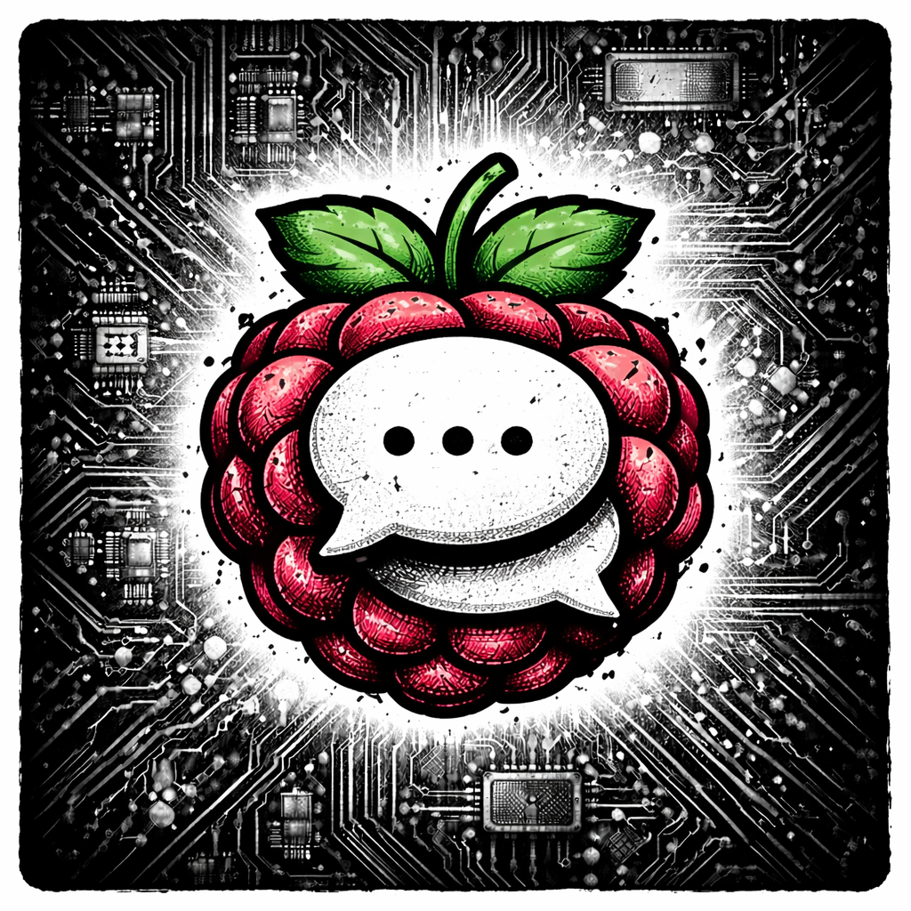
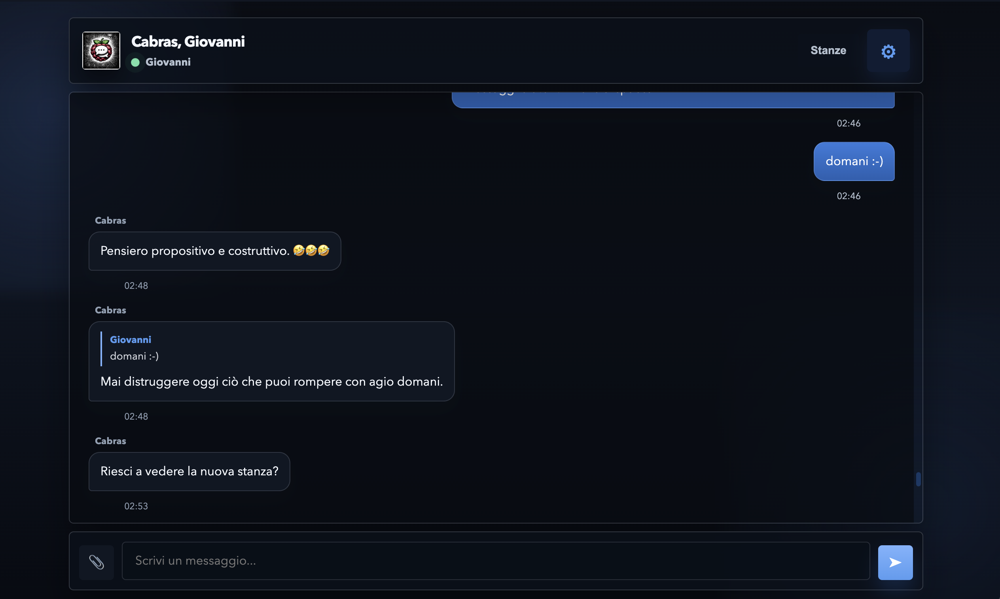
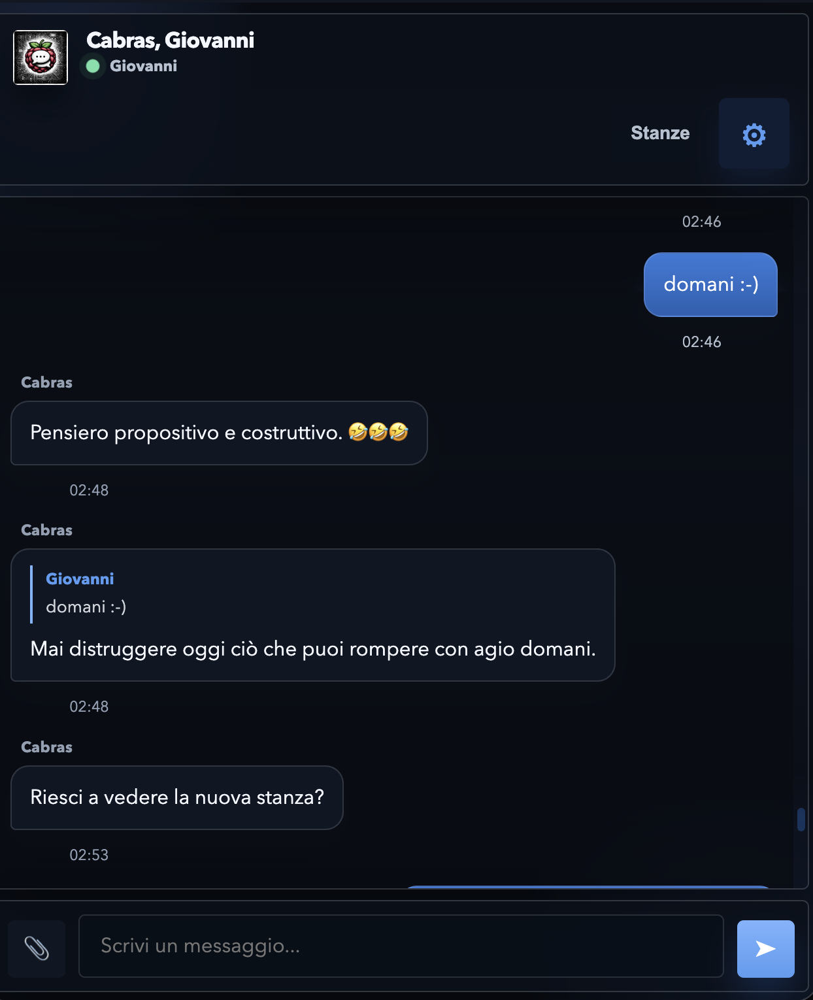

<div align="center">



# raspi-chat

**Self-hosted web chat built for Raspberry Pi and small home servers.**

Realtime, PWA-ready, framework-free — light enough for an old Pi, hackable enough to make it yours.

[](https://github.com/tongatron/raspi-chat/actions/workflows/ci.yml)


[**Live demo**](https://chat.tongatron.org/chat) · [Documentation](#-documentation) · [🇮🇹 Leggi in italiano](README.it.md)

<br />


<br />


</div>

---

## Table of contents

- [Why raspi-chat](#why-raspi-chat)
- [Features](#-features)
- [Quick start](#-quick-start)
- [Documentation](#-documentation)
- [Tech stack](#-tech-stack)
- [Project structure](#-project-structure)
- [Security](#-security)
- [Tests & CI](#-tests--ci)
- [Roadmap](#-roadmap)
- [License](#-license)

## Why raspi-chat

`raspi-chat` makes sense if you want:

- a **simple chat to self-host** for family, friends, or a small community
- something **lighter than** Matrix, Rocket.Chat, or Slack/Discord
- an app that **runs well even on older Raspberry Pi** boards
- a **clear, framework-free codebase** you can actually read and adapt

It is not an enterprise messenger. It is a pragmatic, small, and easy-to-modify codebase — with few external dependencies, local storage, and a simple deploy story.

## ✨ Features

- 💬 **Realtime messaging** over WebSocket (`/chat/ws`), with online-user presence
- 🔒 **Private & public rooms** — closed-membership rooms by default, plus public rooms anyone can discover and self-join
- 📎 **Attachments & location** — a `+` menu to upload images, video, audio, PDF, Office docs, text and zip (rendered inline), or share your location as an OpenStreetMap card
- 🔗 **Link previews** for URLs pasted into the chat
- ⭐ **Favorite messages** — private, per-user bookmarks with a dedicated Favorites view
- 📅 **Join notices & date separators** — a centered "user joined" system message and once-a-day date dividers
- 🔔 **Web Push notifications** — standard VAPID push, from the browser and the Android app
- 📱 **PWA + Android app** — installable PWA and a sideload TWA APK (no Play Store needed)
- 🖥️ **Terminal CLI client** — chat from a shell, with auto-reconnect and an offline outbox queue
- 🔐 **At-rest encryption (opt-in)** — encrypt `chat.db` and uploaded attachments with a single `CHAT_DB_KEY`
- 💾 **Admin backup & restore** — download and restore the database from the web panel or `curl`, encryption-aware
- 🧙 **Guided web setup** — a `/setup` wizard that writes your config and generates the systemd, nginx, and Cloudflare files
- 👥 **Roles** — `admin`, `superuser`, and `user`

> See the [**Features guide**](docs/features.md) for the full details of each.

## 🚀 Quick start

### Local

```bash
git clone https://github.com/tongatron/raspi-chat.git
cd raspi-chat
npm install
npm run check
npm start
```

- Not configured yet? Open **`http://127.0.0.1:3000/setup`** and follow the wizard.
- Already have `.env` and `config/chat-users.json`? The chat is at **`http://127.0.0.1:3000/chat`**.

### Raspberry Pi

```bash
git clone https://github.com/tongatron/raspi-chat.git /srv/apps/raspi-chat
cd /srv/apps/raspi-chat
bash ops/install-rpi.sh
```

Then start the app once (`npm start`), open `/setup`, complete the steps, and run
`sudo bash data/setup-generated/finish-setup.sh` to install and enable the systemd service.

> Full walkthrough — including the guided wizard, users, and environment variables — in the [**Installation guide**](docs/installation.md).

## 📖 Documentation

Detailed docs live in [`docs/`](docs/). Start here:

| Guide | What's inside |
|-------|---------------|
| 📥 [Installation](docs/installation.md) | Local & Raspberry Pi setup, the guided web wizard, users, environment variables |
| ✨ [Features](docs/features.md) | Rooms, attachments, favorites, encryption, backup/restore, notifications, Android app |
| 🖥️ [CLI client](docs/cli.md) | Using the chat from a terminal |
| 🚀 [Deploy](docs/deploy.md) | systemd, nginx, Cloudflare Tunnel |
| 🛠️ [Development](docs/development.md) | API endpoints, tests, quick checks |
| 🗺️ [Roadmap](docs/roadmap.md) | Planned next steps |

The `docs/` folder is also structured as a [GitBook](docs/SUMMARY.md) table of contents.

## 🧱 Tech stack

- **Backend** — [Node.js](https://nodejs.org/) 20+ · [Fastify 5](https://fastify.dev/) · [`ws`](https://github.com/websockets/ws) WebSockets
- **Storage** — local SQLite via [`better-sqlite3-multiple-ciphers`](https://github.com/m4heshd/better-sqlite3-multiple-ciphers) (transparent at-rest encryption)
- **Frontend** — framework-free HTML/CSS/JS, installable **PWA** with a service worker
- **Notifications** — [Web Push](https://developer.mozilla.org/docs/Web/API/Push_API) with VAPID ([`web-push`](https://github.com/web-push-libs/web-push))
- **Android** — [Bubblewrap](https://github.com/GoogleChromeLabs/bubblewrap) TWA wrapping the PWA
- **Tooling** — no test framework: Node's built-in `node --test` runner + GitHub Actions CI

## 🗂️ Project structure

```text
raspi-chat/
├── cli/            Terminal chat client
├── config/         User & asset-link configuration examples
├── docs/           Documentation (GitBook)
├── ops/            Raspberry deploy scripts & encryption tools
├── public/         Frontend, PWA assets, service worker
├── specs/          Feature specifications (one folder per feature)
├── src/            Fastify backend (routes, services)
├── tests/          Node --test suites
├── .env.example
├── package.json
└── server.js
```

> The repo is the source of truth for the app. It does **not** contain your `.env` or `config/chat-users.json` — those are created locally or by the setup wizard.

## 🔐 Security

`chat.db` and uploaded attachments can be encrypted **at rest** with a single opt-in key:

```bash
# generate a strong key and store it in .env (git-ignored)
echo "CHAT_DB_KEY=$(openssl rand -hex 32)" >> .env

# encrypt an existing plaintext database and attachments (each makes a backup first)
CHAT_DB_KEY=... node ops/encrypt-db.js
CHAT_DB_KEY=... node ops/encrypt-uploads.js
```

Without a key, behaviour is unchanged (plaintext, baseline). **Keep `CHAT_DB_KEY` safe outside the Pi** — if you lose it, encrypted data is unrecoverable. Details and admin backup/restore in the [Features guide](docs/features.md#encryption-and-backups).

> On the reference deployment (`raspi4`), at-rest encryption of `chat.db` and all attachments has been **active in production since 2026-07-20**.

## 🧪 Tests & CI

The suite uses Node's built-in runner (no extra dependencies) and exercises the HTTP layer with `app.inject()` in an isolated temporary directory — it never starts a server or touches production data.

```bash
npm run check   # syntax check of every source file
npm test        # run the test suite
```

The same checks run automatically on every push and pull request via [GitHub Actions](.github/workflows/ci.yml). From v1.1 onward, every new feature ships with its own tests.

## 🗺️ Roadmap

Planned next steps are tracked in [`docs/roadmap.md`](docs/roadmap.md).

## 📄 License

Released under the **ISC** license (see `package.json`).
